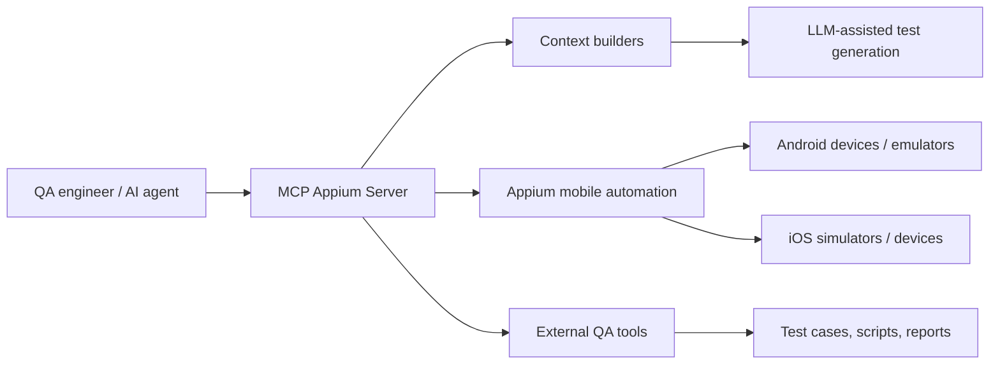

# Architecture

## Workflow

1. Requirements, UI context, and existing QA assets are collected outside the server.
2. The MCP server exposes structured mobile automation and inspection tools.
3. AI assistants use those tools to explore app state, capture UI context, and support test creation.
4. Human reviewers approve generated test cases and automation scripts before they are stored or executed.

## Boundaries

- Secrets and integration tokens must stay outside the repository.
- Generated screenshots, device dumps, and local runtime files should not be committed.
- The server is a tooling foundation for the broader AI-driven QA automation workflow.
